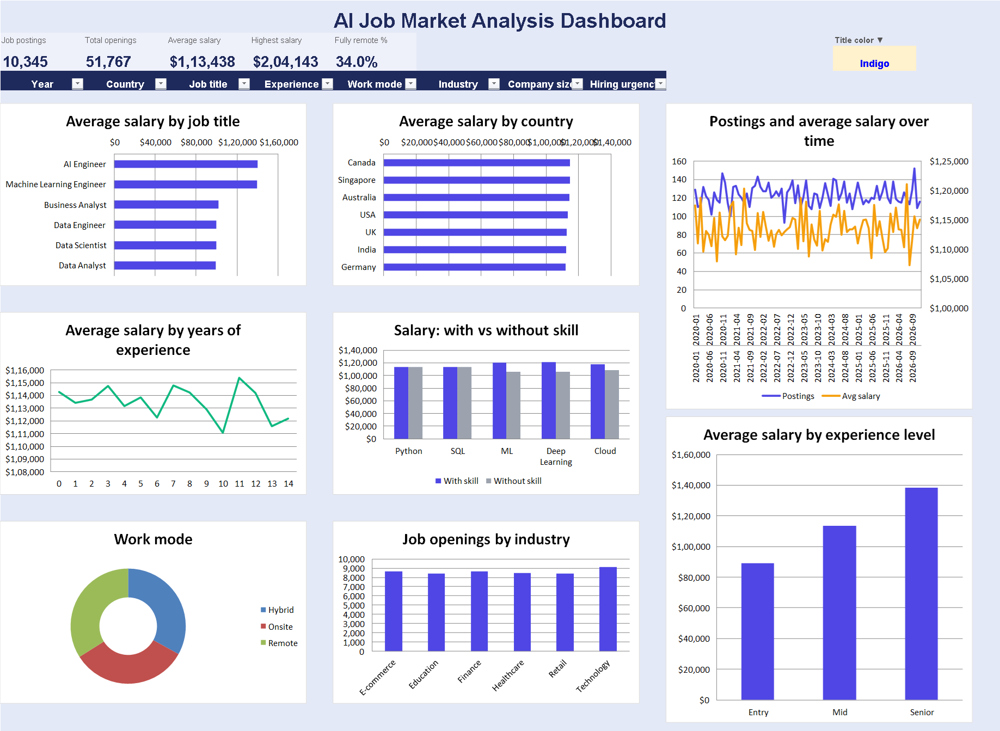

# AI Job Market Analytics

An end-to-end **Data Analytics project** focused on analyzing the AI job market using Python, SQL, Excel, and data visualization techniques.

The project explores job-market trends such as **job roles, salaries, experience levels, work modes, industries, locations, and other factors** to identify useful patterns and insights from AI-related job data.

---

## 📌 Project Overview

The AI industry is growing rapidly, creating demand for different technical and non-technical job roles.

This project analyzes an AI job-market dataset to understand:

* Which job roles are in demand
* Salary patterns across different roles and experience levels
* Distribution of jobs by work mode
* Industry-wise job distribution
* Experience-level trends
* Geographic/job-location patterns
* Other factors influencing AI job opportunities

The project combines **Python-based data analysis, SQL querying, and Excel dashboard visualization** to demonstrate an end-to-end analytics workflow.

---

## 🎯 Objectives

The main objectives of this project are:

1. Analyze the structure and characteristics of AI job-market data.
2. Clean and prepare the dataset for analysis.
3. Explore job roles, salaries, industries, and experience levels.
4. Use SQL to answer business-oriented analytical questions.
5. Create visualizations to communicate important trends.
6. Build an interactive Excel dashboard.
7. Generate meaningful insights that can support data-driven understanding of the AI job market.

---

## 🛠️ Tools & Technologies

| Tool / Technology   | Purpose                                     |
| ------------------- | ------------------------------------------- |
| **Python**          | Data cleaning and exploratory data analysis |
| **Pandas**          | Data manipulation and analysis              |
| **NumPy**           | Numerical operations                        |
| **Matplotlib**      | Data visualization                          |
| **SQL / MySQL**     | Querying and analyzing structured data      |
| **Microsoft Excel** | Dashboard and visualization                 |
| **VS Code**         | Development environment                     |
| **Git & GitHub**    | Version control and project hosting         |

---

## 📂 Project Structure

```text
AI-Job-Market-Analytics/
│
├── data/
│   └── raw/
│       └── AI job market dataset
│
├── python/
│   └── 01_ai_job_market_analysis.py
│
├── sql/
│   └── 01_ai_job_market_queries.sql
│
├── images/
│   └── ai_job_market_dashboard.png
│
└── README.md
```

---

## 📊 Data Analysis Workflow

The project follows a standard data-analytics workflow:

### 1. Data Collection

The raw AI job-market dataset is stored in the `data/raw/` directory.

### 2. Data Cleaning

Python and Pandas are used to:

* Inspect the dataset
* Identify missing values
* Check duplicate records
* Handle inconsistent data
* Convert columns into appropriate data types
* Prepare the dataset for analysis

### 3. Exploratory Data Analysis

The dataset is explored to understand:

* Job-role distribution
* Salary trends
* Experience levels
* Work modes
* Industries
* Locations
* Other relevant job-market attributes

### 4. SQL Analysis

SQL queries are used to perform analytical operations such as:

* Aggregations
* Filtering
* Grouping
* Sorting
* Salary analysis
* Role-wise analysis
* Experience-level analysis
* Industry-level analysis

### 5. Dashboard Development

An Excel dashboard is used to present important findings through:

* KPI cards
* Charts
* Filters
* Work-mode analysis
* Industry analysis
* Experience-level analysis
* Other job-market visualizations

---

## 📈 Dashboard

The Excel dashboard provides a visual overview of the AI job market and allows important trends to be understood quickly.

### Dashboard Preview



---

## 🔍 Key Areas of Analysis

### 💼 Job Roles

Analysis of different AI-related job positions helps understand the distribution of opportunities across roles.

### 💰 Salary Analysis

Salary information is analyzed to understand differences across:

* Job roles
* Experience levels
* Industries
* Other relevant categories

### 🏢 Industry Analysis

The project examines how AI-related job opportunities are distributed across different industries.

### 🏠 Work Mode Analysis

Job opportunities are analyzed according to work arrangements such as:

* Remote
* Hybrid
* On-site

### 📚 Experience-Level Analysis

The project examines job distribution and salary patterns across different experience levels.

### 🌍 Location Analysis

Job-market data is also explored geographically to identify location-based patterns in AI employment.

---

## 📌 Business Questions

Some of the questions explored in this project include:

1. What are the most common AI-related job roles?
2. How are jobs distributed across experience levels?
3. How do salaries vary between different job roles?
4. Which industries have more AI-related opportunities?
5. How are jobs distributed across remote, hybrid, and on-site work modes?
6. Which locations have a higher concentration of AI-related jobs?
7. How does experience level relate to salary?
8. What patterns can be identified from the overall AI job market?

---

## 📊 Skills Demonstrated

This project demonstrates practical skills in:

* Data Cleaning
* Exploratory Data Analysis
* Data Manipulation
* Data Visualization
* SQL Querying
* Excel Dashboard Development
* KPI Analysis
* Business Question Analysis
* Analytical Thinking
* Data Storytelling

---

## 🚀 How to Run the Project

### Step 1: Clone the Repository

```bash
git clone <repository-url>
```

### Step 2: Navigate to the Project

```bash
cd AI-Job-Market-Analytics
```

### Step 3: Install Required Python Libraries

```bash
pip install pandas numpy matplotlib
```

### Step 4: Run the Python Analysis

```bash
python python/01_ai_job_market_analysis.py
```

### Step 5: SQL Analysis

Open:

```text
sql/01_ai_job_market_queries.sql
```

Run the queries using **MySQL** or another compatible SQL environment.

---

## 📁 Dataset

The raw dataset used for this project is stored inside:

```text
data/raw/
```

The dataset contains information related to AI job-market opportunities and is used for exploratory and analytical purposes.

> **Note:** The analysis and conclusions depend on the dataset used in this project and should not be interpreted as a complete representation of the entire global AI job market.

---

## 📌 Project Highlights

* End-to-end data analytics workflow
* Python-based data analysis
* SQL-based business queries
* Excel dashboard
* KPI-based reporting
* Data visualization
* AI job-market trend analysis
* GitHub-ready project structure

---

## 👨‍💻 Author

**Deepak Kumar Sah**

B.Tech Computer Science & Engineering
Teerthanker Mahaveer University, Moradabad

### Skills

**Python | SQL | Excel | Power BI | Pandas | MySQL | Data Analysis | Data Visualization**

---

## ⭐ Project Purpose

This project was created as part of my **Data Analytics learning and portfolio development** to demonstrate practical experience in transforming raw data into meaningful insights using Python, SQL, and Excel.

If you find this project useful, consider giving the repository a ⭐ on GitHub.
